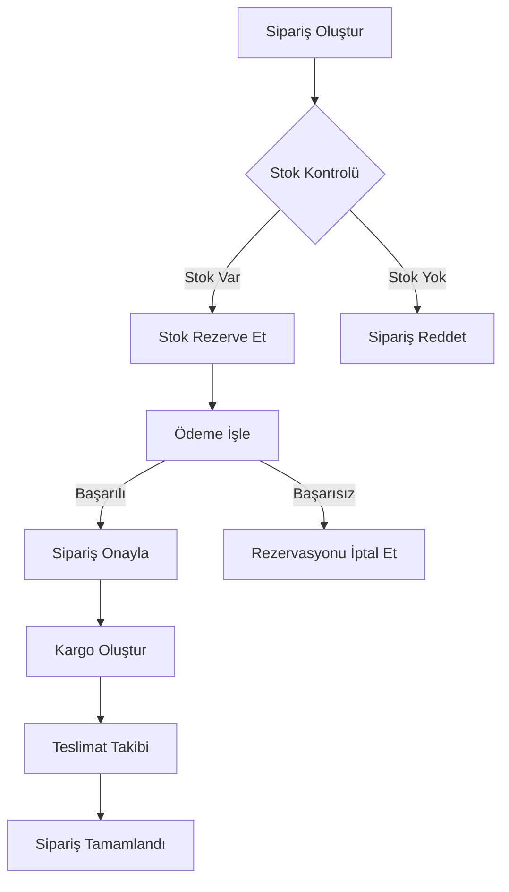

# Order Processing

## Sipariş Akışı



## Sipariş Durumları

### Durum Geçişleri

| Durum               | Açıklama            | Sonraki Durum                         |
| ------------------- | ------------------- | ------------------------------------- |
| `PENDING`           | Sipariş oluşturuldu | `PAYMENT_PENDING`, `CANCELLED`        |
| `PAYMENT_PENDING`   | Ödeme bekleniyor    | `PAYMENT_CONFIRMED`, `PAYMENT_FAILED` |
| `PAYMENT_CONFIRMED` | Ödeme onaylandı     | `PREPARING`, `CANCELLED`              |
| `PREPARING`         | Hazırlanıyor        | `SHIPPED`, `CANCELLED`                |
| `SHIPPED`           | Kargoya verildi     | `IN_TRANSIT`                          |
| `IN_TRANSIT`        | Yolda               | `OUT_FOR_DELIVERY`                    |
| `OUT_FOR_DELIVERY`  | Dağıtımda           | `DELIVERED`, `DELIVERY_FAILED`        |
| `DELIVERED`         | Teslim edildi       | `COMPLETED`, `RETURN_REQUESTED`       |
| `COMPLETED`         | Tamamlandı          | -                                     |
| `CANCELLED`         | İptal edildi        | -                                     |
| `REFUNDED`          | İade edildi         | -                                     |

## Sipariş Oluşturma

### Validation Rules

```typescript
class CreateOrderDto {
  @IsNotEmpty()
  userId: string;

  @IsArray()
  @ArrayMinSize(1)
  @ValidateNested({ each: true })
  items: OrderItemDto[];

  @IsNotEmpty()
  @ValidateNested()
  shippingAddress: AddressDto;

  @IsOptional()
  @ValidateNested()
  billingAddress?: AddressDto;

  @IsOptional()
  couponCode?: string;

  @IsOptional()
  notes?: string;
}
```

### Business Rules

1. **Minimum Sipariş Tutarı**: 50 TL
2. **Maksimum Ürün Adedi**: 100 adet
3. **Stok Kontrolü**: Gerçek zamanlı
4. **Fiyat Kontrolü**: Her ürün için güncel fiyat kontrolü
5. **Kupon Kontrolü**: Kupon geçerliliği ve kullanım limiti

### Example Request

```typescript
const order = await orderService.create({
  userId: 'user-123',
  items: [
    {
      productId: 'prod-456',
      variantId: 'var-789',
      quantity: 2,
      price: 29.99,
      name: 'T-Shirt',
      sku: 'TSH-BLU-M',
    },
  ],
  shippingAddress: {
    firstName: 'Ahmet',
    lastName: 'Yılmaz',
    phone: '+905551234567',
    street: 'Atatürk Cad. No:123',
    district: 'Kadıköy',
    city: 'Istanbul',
    zipCode: '34710',
    country: 'TR',
  },
  couponCode: 'SUMMER25',
  notes: 'Lütfen öğleden sonra teslim edin',
});
```

## Stok Yönetimi

### Reservation System

```typescript
// Stok rezervasyonu
const reservation = await inventoryService.reserve({
  items: order.items,
  orderId: order.id,
  ttl: 300, // 5 dakika
});

// Rezervasyon onayı
await inventoryService.confirmReservation(reservation.id);

// Rezervasyon iptali
await inventoryService.cancelReservation(reservation.id);
```

### Stok Güncelleme Events

```typescript
// Stok azaltma
eventBus.publish('inventory.decreased', {
  productId: 'prod-456',
  quantity: 2,
  orderId: 'order-789',
  timestamp: new Date(),
});

// Stok artırma (iade durumunda)
eventBus.publish('inventory.increased', {
  productId: 'prod-456',
  quantity: 2,
  orderId: 'order-789',
  reason: 'order_cancelled',
  timestamp: new Date(),
});
```

## Ödeme İşleme

### Payment Flow

1. **Payment Intent Oluştur**

   ```typescript
   const paymentIntent = await paymentService.createIntent({
     amount: order.total,
     currency: 'TRY',
     orderId: order.id,
   });
   ```

2. **3D Secure Kontrolü**

   ```typescript
   if (paymentIntent.requires3DSecure) {
     return {
       status: 'requires_action',
       redirectUrl: paymentIntent.redirectUrl,
     };
   }
   ```

3. **Ödeme Onayla**

   ```typescript
   const payment = await paymentService.confirm(
     paymentIntent.id,
     paymentMethod,
   );
   ```

4. **Order Durumu Güncelle**
   ```typescript
   await orderService.updateStatus(order.id, 'PAYMENT_CONFIRMED');
   ```

### Payment Retry Logic

```typescript
const retryConfig = {
  maxRetries: 3,
  retryDelay: 1000,
  backoffMultiplier: 2,
  retryableErrors: ['network_error', 'gateway_timeout', 'service_unavailable'],
};
```

## Kargo Entegrasyonu

### Otomatik Kargo Seçimi

```typescript
const cargoSelection = await cargoService.selectBestOption({
  weight: calculateWeight(order.items),
  volume: calculateVolume(order.items),
  destination: order.shippingAddress,
  priority: order.priority,
  criteria: 'cost', // 'cost' | 'speed' | 'reliability'
});
```

### Kargo Oluşturma

```typescript
const shipment = await cargoService.createShipment({
  orderId: order.id,
  provider: cargoSelection.provider,
  sender: {
    name: 'Company Warehouse',
    address: warehouseAddress,
  },
  receiver: order.shippingAddress,
  packages: [
    {
      weight: 1.5, // kg
      dimensions: {
        length: 30,
        width: 20,
        height: 10,
      },
    },
  ],
});
```

### Tracking Events

```typescript
// Kargo takip eventi
eventBus.subscribe('shipment.status_updated', event => {
  console.log(`Order ${event.orderId}: ${event.status}`);

  // Kullanıcıya bildirim gönder
  notificationService.send({
    userId: event.userId,
    type: 'shipment_update',
    data: event,
  });
});
```

## Sipariş İptali

### Cancellation Rules

```typescript
const canCancel = (order: Order): boolean => {
  const allowedStatuses = [
    'PENDING',
    'PAYMENT_PENDING',
    'PAYMENT_CONFIRMED',
    'PREPARING',
  ];

  return (
    allowedStatuses.includes(order.status) &&
    order.createdAt > Date.now() - 24 * 60 * 60 * 1000
  );
};
```

### Cancellation Process

```typescript
async function cancelOrder(orderId: string, reason: string) {
  const order = await orderService.findById(orderId);

  // 1. Stok rezervasyonunu iptal et
  await inventoryService.releaseReservation(order.id);

  // 2. Ödeme iadesi başlat
  if (order.payment?.status === 'COMPLETED') {
    await paymentService.refund(order.payment.id);
  }

  // 3. Kargoya verilmişse kargo iptali
  if (order.shipment) {
    await cargoService.cancel(order.shipment.id);
  }

  // 4. Sipariş durumunu güncelle
  await orderService.updateStatus(orderId, 'CANCELLED', reason);

  // 5. Bildirim gönder
  await notificationService.send({
    userId: order.userId,
    type: 'order_cancelled',
    data: { orderId, reason },
  });
}
```

## Event-Driven Architecture

### Published Events

```typescript
// Order events
'order.created';
'order.updated';
'order.cancelled';
'order.completed';

// Payment events
'order.payment.pending';
'order.payment.confirmed';
'order.payment.failed';
'order.payment.refunded';

// Shipping events
'order.shipped';
'order.in_transit';
'order.delivered';
'order.delivery_failed';
```

### Event Handlers

```typescript
@EventsHandler(OrderCreatedEvent)
export class OrderCreatedHandler {
  async handle(event: OrderCreatedEvent) {
    // Send confirmation email
    await this.emailService.sendOrderConfirmation(event.order);

    // Update analytics
    await this.analyticsService.trackOrderCreated(event.order);

    // Notify warehouse
    await this.warehouseService.notifyNewOrder(event.order);
  }
}
```

## Performance Optimization

### Database Indexing

```sql
CREATE INDEX idx_orders_user_id ON orders(user_id);
CREATE INDEX idx_orders_status ON orders(status);
CREATE INDEX idx_orders_created_at ON orders(created_at DESC);
CREATE INDEX idx_order_items_product_id ON order_items(product_id);
```

### Caching Strategy

```typescript
// Cache order calculations
@Cacheable({ ttl: 900 })  // 15 minutes
async calculateOrderTotal(orderId: string) {
  // ...calculation logic
}

// Cache user's recent orders
@Cacheable({ ttl: 300 })  // 5 minutes
async getUserOrders(userId: string, limit: number = 10) {
  // ...query logic
}
```

### Batch Processing

```typescript
// Bulk order updates
await orderService.bulkUpdateStatus(orderIds, 'PREPARING', {
  batchSize: 100,
  parallel: true,
});
```
